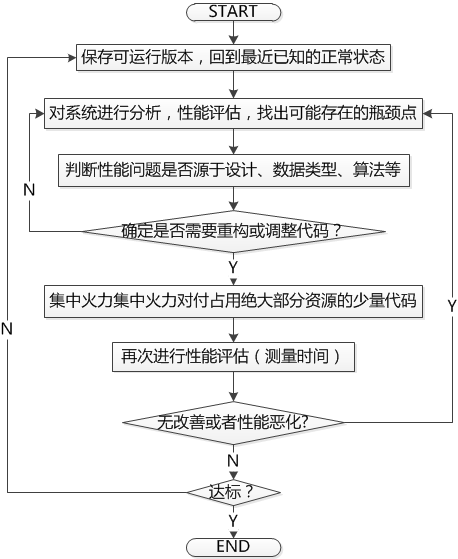

#**Android性能优化总结**

##前言
性能优化本身是一个很大的主题，涵盖程序的方方面面，任何不慎的操作，都有可能对性能造成比较大的影响，要知道程序的性能是可以累加的，多处的性能低下，会影响整体的性能，其后果可能也是多方面的，本文总结了目前工作中，所需要知道的大部分性能优化点，一部分个人总结，一部分来自于互联网。但整体上，都是提纲性的，并没有列出具体的实例，因为写这方面主题的达人实在太多了，所以，我得站在巨人的肩膀上，具体细节，请参考对应的链接。

###性能低下的现象
```text
- 游戏：界面很卡，FPS 低
- 界面无响应
- 服务器响应速度慢
- ...
```
###性能低下的后果：降低用户体验
```text
- 用户流失
- 项目失败
- 引发灾难
…
```
###容易引发性能问题的点
```text
- 硬件
- IO操作
- 数据库
- 网络
- 函数调用
- 数据结构
- 程序逻辑
- ...
```
###从全局考虑
```text
- 硬件性能
- 架构设计
- 核心数据结构
- ...
```
###从微观考虑
```text
- 小规模修改程序，提高性能：程序的性能是可以累加的
- 简单代码设计
- 类和函数设计：合适的数据类型和算法
    - 用快速排序代替冒泡排序
    - 用二分查找代替线性查找
- 业务逻辑的实现
- ...
```
###一些观点
```text
- 高效代码 ≠ 更好代码 ≠ 高质量代码(易修改，易扩充，易维护)
- 80/20 法则：4%的代码占用了50%以上的运行时间
- 随时随地进行优化 **==>** 将陷入无休止的优化泥潭
- 开发阶段前期：功能都未实现，何谈优化，但在设计的时候，需要考虑到对应风险。
- 开发阶段中后期：功能部分完善，通过现象进行模块优化
- 开发阶段后期：功能完善，充分考虑整体性，通过现象进行系统优化
- 后期优化无法满足性能要求----架构先天不足，只能大批量重构
- 过分提高性能会损害程序的可读性和可维护性
- 优先实现功能，然后再进行优化
- 程序功能的正确性比性能更重要
- 真正高性能的程序设计：
    more small, more fast
    more simple, more fast
- ...
```
###方法论
在进行性能优化前，确保该功能是否已基本完整。



优化步骤(Key Points)
```text
- 是否考虑通过修改需求来提高性能？
- 是否考虑通过修改整体设计提高性能？
- 是否考虑通过来修改类的设计提高性能？
- 在开始修改前，程序是完全正确的么？
- 是否在修改前是否进行性能评估？
- 是否记录了每次修改后的性能的变化？
- 如果没有带来预期的性能提高，是否完全放弃所做的代码调整？
- 是否对每个性能瓶颈进行不止一次的尝试？
- 是否反复进行代码调整，直到最优？
- ...
```

###性能瓶颈的发现
找出瓶颈，集中火力对付占用绝大部分资源的少量代码。
途径：
1. Code Review
通过最基本优化策略优化代码
2. 代码性能测量
 * 通过性能Log记录函数调用时间，找出瓶颈点
```java
Log.d("Performance", "Load media info begin......");
long start = System.currentTimeMillis();
    ......
Log.d("Performance", "Load media info end, Total Time: " + (System.currentTimeMillis() - start) + " ms");
```
 * 使用性能分析工具：
```text
Traceview(参考：Android性能调优工具TraceView介绍)
Monkey
MonkeyRunner
```

注：后两个我个人没有使用过，不做介绍，优先推荐使用TraceView工具

##如何优化？
优化本身是一个很大的主题，我这是主要是针对于Android平台来说的。个人认为，优化可以分成好几部分：
一、是JAVA语法层次通用的优化，如尽量使用局部变量(栈变量)，IO缓冲等。
二、是通用的Android性能优化，如同步改异步，各种缓存的使用等
三、是应用程序内部的性能优化，如内部逻辑、数据插入及查找、数据结构的安排与组织等
**以下部分针对于上述3种类型，分别进行简要说明**


##**1. 基本优化策略：JAVA语法层次的优化**[参考](http://blog.csdn.net/aomandeshangxiao/article/details/8115612#t1)

###类和对象使用技巧
```java
- 尽量少用 new 生成新对象
- 使用 clone 方法生成新对象
- 尽量使用局部变量栈变量
- 减少方法调用
- 使用 final 类和 final/static/private 方法
- 让访问实例内变量的 getter/setter 方法变成 final  
- 避免不需要的 instanceof 操作  
- 避免不需要的造型操作  
- 尽量重用对象  
- 不要重复初始化变量  
- 不要过分创建对象
```

###**Java IO技巧**
```java
- 使用缓冲提高 IO 性能
- InputStream 比 Reader 高效; OutputStream 比 Writer 高效
- 在适当的时候用 byte 替代 char
- 有缓冲的块操作 IO 要比缓冲的流字符 IO 快
- 序列化时使用原子类型
- 在 finally 块中关闭 stream 
- SQL 语句
- 尽早释放资源
- 异常 Exceptions 使用技巧
- 避免使用异常来控制程序流程
- 尽可能重用异常
- 将 try...catch 块移出循环
```
###线程使用技巧
```java
- 在使用大量线程 Threading 的场合使用线程池管理
- 防止过多的同步
- 同步方法而不要同步整个代码段
- 在追求速度的场合用 ArrayList 和 HashMap 代替 Vector 和 Hashtable
- 使用 notify 而不是 notifyAll
- 不要在循环中调用 synchronized 同步方法   
- 单线程应尽量使用 HashMap, ArrayList
```

###其它常用技巧
```java
- 使用移位操作替代乘除法操作可以极大地提高性能
- 对 Vector 中最后位置的添加删除操作要远远快于埘第一个元素的添加删除操作
- 当复制数组时使用 System.arraycopy 方法
- 使用复合赋值运算符
- 用 int 而不用其它基本类型
- 在进行数据库连接和网络连接时使用连接池
- 用压缩加快网络传输速度一种常用方法是把相关文件打包到一个 jar 文件中
- 在数据库应用程序中使用批处理功能
- 消除循环体中不必要的代码
- 为 vectors 和 hashtables 定义初始大小  
- 如果只是查找单个字符的话用 charat 代替 startswith
- 在字符串相加的时候使用 charat() 代替 startswith() 如果该字符串只有一个字符的话  
- 对于 boolean 值避免不必要的等式判断  
- 对于常量字符串用 String 代替 Stringbuffer   
- 用 String tokenizer 代替 indexof 和 substring  
- 使用条件操作符替代 if cond else  结构 
- 不要在循环体中实例化变量  
- 确定 Stringbuffer 的容量  
- 不要总是使用取反操作符  
- 与一个接口进行 instanceof 操作  
- 采用在需要的时候才开始创建的策略  
- 通过 StringBuffer 的构造函数来设定他的初始化容量可以明显提升性能  
- 合理使用 java.util.Vector
- 不要将数组声明为 public static final
- HaspMap 的遍历
- Array 数组和 ArrayList 的使用  
- StringBuffer 和 StringBuilder 的区别
- 尽量使用基本数据类型代替对象   
- 用简单的数值计算代替复杂的函数计算比如查表方式解决三角函数问题  
- 使用具体类比使用接口效率高但结构弹性降低了但现代 IDE 都可以解决这个问题 
- 考虑使用静态方法
- 应尽可能避免使用内在的 GET/SET 方法 
- 避免枚举浮点数的使用   
- 二维数组比一维数组占用更多的内存空间大概是 10 倍计算 
- SQLite
- 奇偶判断
```

**实际上，Android 本身的 Training 文档也提供给我们很多可参考的内容，以下仅枚举一些 KeyPoint，当然，有的内容是与上面的策略是重复的**

* 原文参考：[Performance Tips](https://developer.android.com/training/articles/perf-tips.html)
* 译文参考：[Android应用开发者指南：性能优化(1)](https://developer.android.com/training/articles/perf-tips.html)
* 其它参考：[Android开发性能优化简介](https://developer.android.com/training/articles/perf-tips.html)

**总体上来说，想要写出高效代码，我们要遵循两条基本的原则：**
* 不作没有必要的工作。
* 尽量避免内存分配。

Key Point
```java
- 避免创建不必要的对象
- 用静态代替虚拟
- 避免内部的 Getters/Setters
- 对常量使用 Static Final修饰符
- 使用改进的 For 循环语法(for-each)
- 在有内部类的情况考虑使用包权限来替代私有访问
- 避免使用浮点数
- 了解并使用类库
- 合理利用 Native 方法
```

##**2. 通用Android性能优化**

**布局优化:**
[(原文参考：ImprovingLayout Performance)](https://developer.android.com/training/articles/perf-tips.html)

* 尽量减少Android程序布局中View的层次，View层次越多，效率就越低
* 使用复用布局
* 使用 ViewStub 懒加载布局 (Android布局技巧：使用ViewStub提高UI性能)
* 使用 ViewHolder、Thread 使 ListView 滚动更加流畅

####其它优化点

* 合理使用异步操作
* 懒加载：当前不需要的数据，不要加载，即按需加载。懒加载的范围是广泛的，可以是数据，可以是View，或者其它
* 使用缓存
 *  图片缓存：包括 MemoryCache 和 DiskCache，可以使用官方DEMO中的 Cache，参考：Displaying Bitmaps Efficiently
 *  单例数据缓存：建立一个管理数据的类，管理所有数据，当主界面消失后，由于Application本身没有实际退出，因此，数据本身也没有释放掉，下次启动时，省去了加载数据的时间，当然，这并不是一个好的行为。
 * 使用 ListView、GridView 的 View 缓存
 * 使用 Message 自身的缓存，避免重复创建 Message 实例
 * 线程池
 * 数据池(可参考 Message Pool 的实现方式)
 * ……
* 数据库优化
 * SQL 优化
 * 建立索引
 * 使用事务
 * ……
* 算法优化
 * 用快速排序代替冒泡排序
 * 用二分查找代替线性查找
 * ……
* 数据结构使用
 * 不要全部使用 ArrayList，合理使用LinkedList等易于插入和删除的集合
 * 合理使用 HashMap、HashSet 来提高查找性能
 * 使用 SparseArray、SparseIntArray、SparseBooleanArray 来替代某些特定的 HashMap
 * ……
* 其它策略
 * 可以考虑延迟处理，避免在同一时间干过多的事情

##**3. 应用程序内部的性能优化**

该部分的优化应该是依据程序的不同而不同，没有万般皆准的法则，目前从我做过的程序来看，实际上，上述的性能优化点基本上已经能够解决很多性能问题了。
在我所做的程序中，主要的优化手段是：
* 程序逻辑简化：分析代码，去掉冗余逻辑
* 数据结构的优化：对集合类的灵活使用，特别是 HashMap 的使用，极大的提高查找性能。
* 批量处理原则：对于需要循环调用地方，采用批量处理

##**总结**

性能优化本身是对代码的重构和反思过程，通过优化性能，能找出我们很多设计、逻辑上的不足。
优化的过程往往很痛苦，但在做过这个过程后，个人在编程水平、设计水平上都会有很大的提高。
很多优化的思想应该做为编码规范的一部分，需要我们反复实践，在写代码时，第一反应所得出的代码就是最优的。