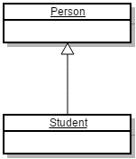
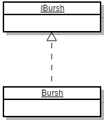
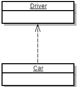
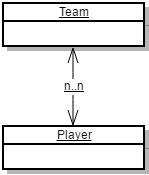
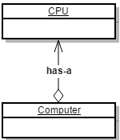
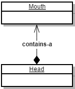

#**UML class relationship**

>http://justsee.iteye.com/blog/808799

| 关系 | UML | 解释 |  注意 |
| :-------------: |:-------------:| -----:| -----:|
| **泛化
(Generalization)**      |  | extends | |
| **实现
(Realization)**      |  | implements | |
| **依赖
(Dependency)**      |  | 局部变量 
方法中的参数
对静态方法的调用 | |
| **关联
(Association)**      |  |  表示类与类之间的联接
类间相互知晓类的属性和方法
0..1(0或1个实例)
0..(对实例的数目没有限制)
1: (只能有一个实例)
1..(至少有一个实例) | |
| **聚合
(Aggregation)**      |  | **关联关系的一种特例**
**has-a(强的关联关系)**
聚合是整体和个体之间的关系 | 他们可以具有各自的生命周期
部分可以属于多个整体对象
也可以为多个整体对象共享
聚合关系是使用实例变量实现的
从java语法上不分出关联和聚合 |
| **组合(合成)
(Composition)**      |  | **关联关系的一种特例**
**contains-a(强的关联关系)** | 不可分的
整体的生命周期结束
也就意味着部分的生命周期结束 |

